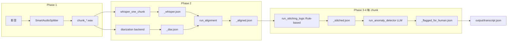

# NeuroAI Transcribe：Pipeline 與程式架構

本文件說明**語音轉錄主線**的資料流、目錄慣例、模組邊界，以及與後端、批次腳本的關係，方便對外討論改版或換模型時對齊上下文。

---

## 1. 儲存與專案分層

### 1.1 頂層目錄（與轉錄最相關）

| 路徑 | 角色 |
|------|------|
| `core/` | 轉錄管線主程式：`run_pipeline`、`overall_pipeline`、切分、ASR/語者/對齊、Stitch、Flag、`config`。 |
| `shared/` | 跨服務共用：`file_manager`（`data/<case>/` 路徑、`create_case`、JSON/status）。 |
| `backend/` | FastAPI：上傳、chunk 編修、匯出；可**子程序呼叫** `python -m core.run_pipeline`。 |
| `frontend/` | 編修介面（讀寫 intermediate 的 JSON）。 |
| `data/` | 實際案例資料（多數為 `.gitignore`，範例結構見下）。 |
| `core/scripts/` | 工具與實驗：批次跑案、`evaluate` 稽核、論文評估、單卡 Whisper 等。 |
| `docs/` | 說明文件（本檔、`evaluate.md`、`DEVOPS.md` 等）。 |

### 1.2 單一案例目錄慣例（`file_manager`）

```
data/<case_name>/
  source/              # 原始影片／音檔（create_case 時可能複製一份進來）
  intermediate/        # Chunk wav、whisper/diar/aligned/stitched/flagged JSON
  output/              # 例如 transcript.json
  case.json            # 案例 metadata
  status.json          # 流程狀態（給前端或監控）
  edited.json          # 常見：人工校稿（非 file_manager 強制，評估腳本預設讀）
```

**案例名稱** `case_name` 即資料夾名，與 `run_pipeline --case` 一致。

---

## 2. 兩條「完整轉錄」入口（務必分辨）

專案內有兩套**都叫完整流程**、但**合併策略不同**的實作：

### 2.1 `core/run_pipeline.py` — `NeuroAIPipeline`（目前後端與批次預設）

- **切 chunk** → 每 chunk 跑 Whisper、Diar、Alignment → **逐 chunk** 做 Stitch → Flag → 將各 chunk 結果 **串接**成一份 list，寫入 `output/transcript.json`。
- **Stitch／Flag 的 LLM 視窗以「單一 chunk 內的 aligned 段落」為單位**，chunk 之間不會再跑一次全域 Stitch。
- CLI：`python -m core.run_pipeline <video_path> [--case NAME] [--force] [--no-stitch]`  
  - `--force`：清空該案 `intermediate` 再跑。  
  - `--no-stitch` 或環境變數 **`SKIP_STITCH=1`**：跳過規則併句，每段 aligned 一對一轉成 stitch 形狀後只做 Flag。  
  - 若路徑為 `data/<case>/source/...` 且未指定 `--case`，會推斷 `case_name`（見 `file_manager.infer_case_name_from_video_path`）。
  - 若你從舊版（LLM Stitch）升級到新版（Rule-based Stitch），建議使用 `--force` 或刪除既有 `*_stitched.json`，避免沿用舊快取混入比較。

### 2.2 `core/overall_pipeline.py` — `OverallPipeline`

- 同樣切 chunk 並產生各 chunk 的 **aligned**。
- **先合併**所有 chunk 的 aligned 段落到**單一時間軸 list**，再對**整份**跑一次 `run_stitching_logic`，最後 Flag；輸出預設為 `output/final_transcript.json`（包成含 metadata 的 object）。
- 內建較多「已存在 chunk 則跳過切分／GPU 清理」等邏輯，適合互動式長影片實驗；**與 `NeuroAIPipeline` 產物檔名、結構不完全相同**。

**與其他工具討論時請先約定：要對齊的是哪一條入口**，否則 stitch 行為與評估對象會不一致。

---

## 3. `NeuroAIPipeline` 階段詳解（主線）

下列檔名皆以 `intermediate/` 下、與 `chunk_<n>_<start_ms>_<end_ms>.wav` **同一幹檔名**為前綴。



### Phase 1：切分 — `core/split.py`

- `SmartAudioSplitter.split_audio`：依 `config.default_num_chunks`（環境變數 `DEFAULT_NUM_CHUNKS`，預設 4）將長音切成多段；在理想切割點附近找靜音或能量低點。
- 相關環境變數：`SILENCE_THRESH`、`MIN_SILENCE_LEN`（見 `core/config.py`）。

### Phase 2：ASR、語者、對齊 — `core/pipeline/phase2.py`（`PipelinePhase2`）

| 步驟 | 實作 | 產物 |
|------|------|------|
| Whisper | **子程序** `python -m core.scripts.whisper_one_chunk <wav> <json>`（隔離崩潰、可 timeout） | `*_whisper.json`（含 `text`、`words`、時間） |
| 語者 | 依 **`DIARIZATION_BACKEND`** 選後端（見下節）；產物格式皆為與對齊相容的 `*_diar.json` | `*_diar.json`（每筆 `start`, `end`, `speaker` 字串） |
| 對齊 | `run_alignment`：將每段 Whisper 與 diar 時間重疊最多的 speaker 對上，.global 時間加 **chunk offset** | `*_aligned.json`（`id`, `start`, `end`, `speaker`, `text`, `flag`） |

#### 語者後端（`DIARIZATION_BACKEND`）

| 值 | 行為 | 備註 |
|----|------|------|
| `whisper_bilstm`（預設） | 使用 `core/speaker_bilstm/` 內的 `load_model` + `inference_on_audio`，以 20s 窗推論 frame 類別，再轉成 `*_diar.json` | 需安裝 `transformers`、`librosa` 等（見 `core/requirements.txt`）；首次會從 HF 下載 `openai/whisper-{size}`。可選 `SPEAKER_CLASS_LABELS`（三類顯示名）、`SPEAKER_INFER_BATCH_SIZE`、`SPEAKER_BILSTM_USE_MEDIAN`。 |
| `pyannote` | 載入 **pyannote** `speaker-diarization-3.1`，對整段 chunk wav 做說話人分離 | 需 `HF_TOKEN`；Pyannote 改為 **延遲 import**，僅在此後端時載入。 |
| `placeholder` | 讀取同幹檔名之 `*_whisper.json`，**每個 Whisper ASR 段**寫一條 diar（時間與該段相同、`speaker` 固定為 `SPEAKER_PLACEHOLDER_LABEL`） | 用於不接 Pyannote、或銜接測試；**不**代表真實語者。須先跑完 Whisper。 |

備註：此 repo 已不再依賴 `Neuro-AI/` 資料夾；推論所需最小子集已收斂至 `core/speaker_bilstm/`。

與 Whisper+BiLSTM checkpoint 相關的**離線分析**（不需跑主流程）：

- `python -m core.scripts.model.analyze_speaker_checkpoint`：由 `model_state_dict` / `config` 推斷結構。
- `python -m core.scripts.model.test_speaker_model_io`：驗證 JSON 契約、placeholder diar 測試。

共用的 placeholder 寫檔邏輯在 **`core/diarization_placeholders.py`**（避免與測試腳本重複）。

**Whisper 細節**（`core/scripts/whisper_one_chunk.py`）：

- **faster-whisper**，模型與 beam 等取自 `config`（`WHISPER_MODEL`、`WHISPER_BEAM_SIZE` 等）。
- 轉錄後以 **OpenCC `s2twp`** 寫入繁體（含逐字 `words`）。
- `vad_filter=True` 可能略過小聲段，影響時間覆蓋率（見 `docs/evaluate.md`）。

**備註**：`PipelinePhase2` 內雖建立 `OpenCC` 實例，但 **對齊階段未再轉一次**，文字來自已轉繁的 Whisper JSON。

### Phase 3–4：Stitch 與 Flag — `core/stitching/`、`core/flagging/`（相容入口仍可用 `core/stitch.py`、`core/flag.py`）

- **Stitch（Phase 3）**：以決定性規則 `merge_aligned_segments` 合併（同 speaker 且 `next_start - prev_end <= STITCH_MERGE_MAX_GAP_SEC`，預設 1.5 秒）；`text` 以純字串連接，並完整保留 `source_ids`。
- Rule-based Stitch 不依賴 LLM，避免模型改寫文字造成字元刪減或 `source_ids` 漏蓋。
- **Flag**：另一輪 LLM 批次，標記 `needs_review`、`suggested_correction` 等（prompt 要求繁體，但無強制後處理）。
- 快取：若已存在 `*_flagged_for_human.json` 則直接載入跳過重算；反之可能跳過已存在之 `*_stitched.json`。

最終將各.chunk 的 flagged list **extend** 合併，寫入 **`output/transcript.json`**（頂層為 **segment list**，與後端/評估假設一致）。

---

## 4. 設定與依賴摘要 (`core/config.py`)

- **路徑**：`project_root`、`data_dir`、`model_cache_dir`。
- **HF**：`HF_TOKEN`（僅 **`DIARIZATION_BACKEND=pyannote`** 時需要；`whisper_bilstm` 預設路徑不依賴 Pyannote token）。
- **語者後端**：
  - `DIARIZATION_BACKEND`：`whisper_bilstm`（預設）| `pyannote` | `placeholder`（別名見 `Config` 原始碼）。
  - `SPEAKER_MODEL_PATH`：BiLSTM checkpoint 預設路徑（預設為專案根下 `models/whisper_medium_bilstm_best.pt`）。
  - `SPEAKER_PLACEHOLDER_LABEL`：`placeholder` 後端寫入的固定 `speaker` 字串（預設 `PLACEHOLDER_SPEAKER`）。
  - `SPEAKER_CLASS_LABELS`：可選，逗號分隔，例如三類時 `標籤0,標籤1,標籤2`（供 BiLSTM 推論對應類別 id→顯示名）。
- **LLM**：`LLM_API_URL`、`OPENAI_API_KEY`（OpenAI 相容；主線保留在 Flag 階段，後續可擴充行為標記用途；Stitch 已不使用）。
- **Stitch 規則參數**：`STITCH_MERGE_MAX_GAP_SEC`（預設 `1.5` 秒）。
- **Whisper / 切分 / GPU**：環境變數見 `Config` 類別欄位。

---

## 5. 批次與評估腳本

| 腳本 | 用途 |
|------|------|
| `core/scripts/data/batch_run_pipeline.py` | 掃描 `data/` 下子資料夾；若**尚無** `intermediate` 目錄則對該案呼叫 `run_pipeline`。注意：有 `intermediate` 會整案跳過（與手動續跑策略不同）。 |
| `core/scripts/evaluate/` | `python -m core.scripts.evaluate --case <name>` 稽核；`python -m core.scripts.evaluate.insights --case <name>` 產生併句前後對照表與 Markdown。詳見 `docs/evaluate.md`。 |

---

## 6. 後端如何觸發管線 (`backend/main.py`)

- `subprocess` 執行：`python -m core.run_pipeline <video_path> --case <case_name>`，`PYTHONPATH` 指向專案根。
- 目的：避免在 API 主進程載入重型 torch/whisper。

路由與資料：`routers/videos.py`、`chunks.py`、`upload.py`、`export.py`；chunk 優先順序與存檔邏輯見 `services/chunk_service.py`（例如 `*_edited.json`）。

---

## 7. 與改進討論相關的「擴張點」（架構層級）

下列為程式邊界清楚、常被拿來做實驗的掛鉤：

1. **切分**：`SmartAudioSplitter` 參數與 chunk 數。
2. **ASR**：`whisper_one_chunk.py`（模型、`vad_filter`、語言、timeout）。
3. **語者**：`pipeline.py` 內 `run_diarization_batch`；後端由 `DIARIZATION_BACKEND` 切換（pyannote / placeholder / whisper_bilstm 掛鉤）。
4. **對齊**：`run_alignment` 的 speaker 投票邏輯。
5. **Stitch / Flag**：Stitch 以規則（speaker + 時間間隔閾值）合併；Flag 仍為 LLM 批次。主要調整點為 `STITCH_MERGE_MAX_GAP_SEC`、`source_ids` 完整性與保字元策略。
6. **合併策略**：`NeuroAIPipeline`（per-chunk stitch）vs `OverallPipeline`（全域 stitch）。

---

## 8. 相關文件

- `docs/evaluate.md`：中間產物與 GT 指標怎麼看。
- `docs/DEVOPS.md`：映像建置與部署片段。

若外部工具需要「單一流程圖檔」，可直接複製本檔第 3 節的 mermaid 或依實際入口改標籤後使用。
