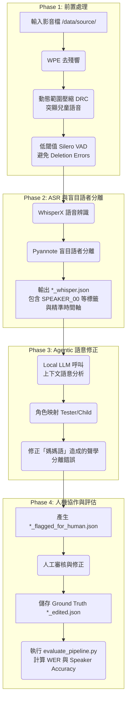

# NeuroAI Transcribe - ADOS 臨床語音處理管線 (Pipeline)

## 1. 系統概覽 (System Overview)
NeuroAI Transcribe 專案旨在解決自閉症診斷觀察量表 (ADOS) 長達 40 分鐘的臨床評估影片分析。在密閉的臨床空間中，高殘響 (Reverberation)、兒童微弱的語音 (Soft speech)，以及成人為了引導孩童而使用的「媽媽語 (Motherese)」，常導致傳統自動語音辨識 (ASR) 與語者分離 (Speaker Diarization) 系統產生嚴重的錯誤與失效。

本管線專為此場景設計，目標為在完全地端 (On-Premise, Local Execution) 的硬體環境中（基於 NVIDIA RTX 5090）安全地處理高機敏醫療資料，確保資料不外流，並產出高精準度的語者分段與文字轉錄結果，輔助臨床專業人員進行診斷評估。

## 2. 微服務與目錄架構 (Microservices Architecture)
本系統採用 Dockerized 微服務架構，將 AI 推論、排程控制、與 Backend API 進行解耦，實現權重與程式碼分離，確保持續交付與部署的靈活性。

*   **`core/`**: 系統的中樞神經，處理排程與核心邏輯 (Orchestrator)。負責協調各個微服務，執行端到端的資料管線處理。
*   **`backend/` & `frontend/`**: 使用者介面與 API 層。`backend/` 負責處理前端的請求與資料庫互動，`frontend/` 提供臨床人員上傳影片、檢視結果與人工修正的介面。
*   **`services/`**: 獨立封裝的 AI 微服務。包含例如 `services/whisper` (負責語音辨識)、`services/pyannote` (負責語者分離)，以及基於 Llama.cpp 封裝的 `llm-server` (負責語意分析與修正)。
*   **`models/` & `data/`**: 純粹掛載權重與音訊檔案的 Shared Volumes。此設計將龐大的模型權重與機敏的臨床資料與程式碼儲存庫分離，易於備份與權限控管。

## 3. 端到端資料流與管線步驟 (End-to-End Data Pipeline)

以下為 NeuroAI Transcribe 處理一筆 ADOS 影片的端到端資料流：

### Phase 1: 前置處理 (Pre-processing)
*   **輸入**: 來自 `/data/source/` 掛載目錄內的原始 ADOS 影音檔。
*   **處理**:
    1.  **WPE (Weighted Prediction Error) 去殘響**: 消除密閉診斷室常見的空間殘響，提升聲學清晰度。
    2.  **動態範圍壓縮 (DRC, Dynamic Range Compression)**: 針對孩童常見的微弱語音 (Soft speech) 進行訊號增強，縮小成人與孩童的音量落差。
    3.  **高召回率語音活動偵測 (High-Recall VAD)**: 設定低閾值的 Silero VAD，盡可能捕捉所有潛在的語音片段，避免在孩童輕聲細語時發生遺漏錯誤 (Deletion Errors)。

### Phase 2: ASR 與盲目語者分離 (Transcription & Blind Diarization)
*   **工具**: WhisperX 結合 Pyannote Audio。
*   **處理**: 在前置處理後的音訊上執行語音轉錄與盲目分離。
*   **輸出**: 產生 `*_whisper.json`，其中包含盲目的語者標籤（如 `SPEAKER_00`, `SPEAKER_01`）以及詞級或句級的精準時間軸 (`start`, `end`)。

### Phase 3: Agentic 語意修正 (Agentic Semantic Correction)
*   **處理**: 利用基於本地端 Llama.cpp 運行的 LLM 代理 (LLM Agent)。
*   **動作**:
    1.  **角色映射**: 分析對話的上下文語意，自動將盲目標籤 (`SPEAKER_00`, `SPEAKER_01`) 精準映射為 `[Tester]` (測試員/成人) 與 `[Child]` (孩童)。
    2.  **聲學錯誤修正**: 傳統聲學模型容易將成人模仿小孩語氣的「媽媽語」誤判為孩童。LLM 利用強大的語意理解能力，校正這類純聲學特徵無法解決的分離錯誤。

### Phase 4: 人機協作與評估 (Human-in-the-Loop & Evaluation)
*   **標記與審核**: 系統會針對不確定性高的片段（如交疊語音、模糊發音）標記，並輸出 `*_flagged_for_human.json`。
*   **人工修正**: 臨床人員可透過前端介面審閱這些標記片段並進行人工修正，確認無誤後儲存為 Ground Truth (如 `*_edited.json`)。
*   **系統評估**: 執行 `evaluate_pipeline.py` 腳本，比對系統輸出與 Ground Truth，計算詞彙錯誤率 (WER) 與語者分類準確率 (Speaker Accuracy)，持續監控並提升管線效能。

## 4. 臨床洞察萃取 (Clinical Insights Extraction)
在獲得高品質且乾淨的轉錄資料後，管線的最後一步是將 JSON 檔案再次輸入給 LLM Agent 進行高階特徵的萃取，以輔助臨床診斷。

*   **時間物理特徵**:
    *   **發言比例 (Speech Ratio)**: 計算 `[Tester]` 與 `[Child]` 的整體說話時間占比。
    *   **換輪延遲 (Turn-taking Latency)**: 測量一方發言結束到另一方開始發言之間的時間差。
    *   **異常遲疑 (Long Pauses)**: 統計不尋常的長時間靜默片段。
*   **語意特徵**:
    *   **仿說 (Echolalia)**: 偵測孩童是否重複測試員的字句。
    *   **代名詞反轉 (Pronoun Reversal)**: 標記出孩童錯誤使用代名詞（如將「我」說成「你」）的臨床特徵。
